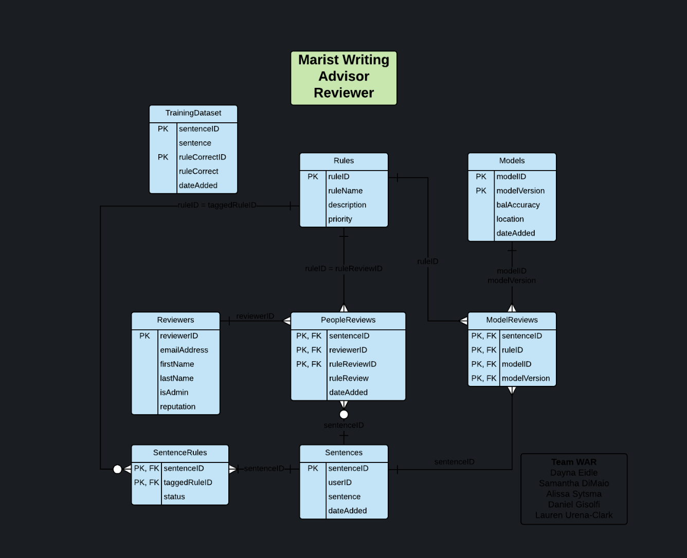

1.  Figure 1.1  ER Diagram

2.  Documentation

Figure 1.1 displays the Marist Writing Advisor Reviewer ER Diagram. It consists of seven tables. Each cell within each table only contains atomic values. The **Reviewers** table has a primary key called reviewerID which is a reviewer’s CWID (their definitive identity). This provides unique authentication for each user of the system. Other non-key attributes in this table are dependent on the primary key. These include emailAddress, firstName, lastName, isAdmin, and reputation. One reviewer can complete zero to many reviews, which is referred to as a **People Review**. A **People Review** belongs to one **Reviewer**. 

The **People Reviews** table consists of three composite primary keys. These include: sentenceID (the ID of sentence being reviewed), reviewerID (the ID of the reviewer), and ruleReviewID (which is the ID of the rule). The other non-key attributes in the PeopleReview table are dependent on the primary key. The attribute ruleReview is the grade the reviewer gives each rule for each sentence. For each rule, 1 is correct and 0 is incorrect or a violation of that rule. The dateAdded refers to the date in which the review is added. 

A single **People Review** refers to a rule. There will be five inserts into **People Reviews** regarding each rule for that review. A **Rule** can be associated with many **People Reviews**. The rules of the sentence are reviewed many times for however many reviews it takes to reach the ¾ criteria. The **Rules** table primary key is ruleID (a rule’s unique identity). Other non-key attributes in this table are dependent on the primary key. These include ruleName, description of the rule, and the rule’s priority. Sentences that have the lowest reviews will have the highest priority because the goal is to have amount of reviews on all sentences to help train the model. 

A **Rule** is related to many **Model Reviews**. A **Model Review** is associated with an individual **Rule**. There will be five inserts into Model Reviews regarding each rule for that review. The **Model Reviews** and the **Sentences** table holds the information regarding why the system originally tagged the sentence. The **Model Reviews** table has four composite primary keys. These include: sentenceID (the ID of sentence being reviewed), ruleID (the ID of the rule), modelID (the unique identity of the model), and version (the numerical count of the model released).  This table can be used as a basis of comparison to hold information regarding previous models and see why they were originally tagged. 

A **Model Review** refers to one **Model**. A **Model** can have many **Model Reviews**.  The **Models** table has two primary keys: modelID and version. The table holds all data regarding the AI. Other non-key attributes in this table are dependent on the primary key. These include balance accuracy, location of the model, and the date the model was added. 

A **Model Review** relates to one **Sentence**. A **Sentence** can belong to many **Model Reviews**. The **Setences** table has a primary key called sentenceID which is the unique identity of the sentence. Other non-key attributes in this table are dependent on the primary key. These include: userID (the ID of the user who the sentence was written by), the actual sentence, and the date the sentence was originally added. A **Sentence** is associated with zero or many **People Reviews**. A Sentence is also associated with one or many **Sentence Rules.** These are the rules tagged in the Sentence (AS INCORRECT OR AS BOTH CORRECT INCORRECT). 

The **Sentence Rules** table has two composite primary keys. SentenceID is the unique of the sentence. TaggedRuleID is the unique ruleID, or whichever rule the Reviewer is referring to at the time. For example, a rule that the system has marked as wrong and the reviewer thinks is correct. A **Rule** is associated with many **Sentence** **Rules** because all rules are taken into account for each sentence. Other non-key attributes in this table are dependent on the primary key. The attribute status is the status review of the rule for each sentence. 

There is also a **TrainingDataset** table that has no direct relationship with other tables in the database. This table holds all the data regarding definitive reviews of the sentences that meet the criteria. It will be used to train the model and produce definitive output. There are two primary keys in this table. The sentenceID is the unique identification of the sentence in the training data. The ruleCorrectID is the unique identification of a rule being correct. The other non-key attributes in the **TrainingDataset** table are dependent on the primary key. These include the actual sentence, a percentage of correctness based on the original rule that was in question for review (RuleCorrect), and the date the sentence was added to the Training Data.  There are no transitive functional dependencies among the attributes.
