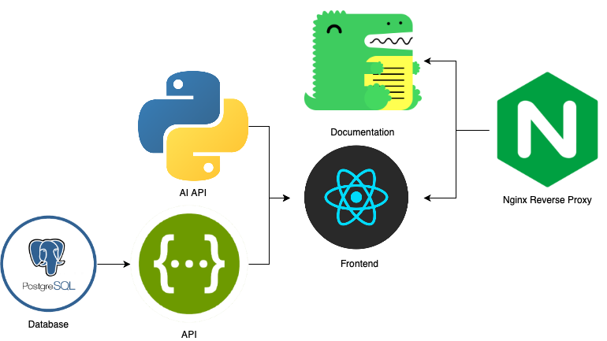

## What is WAR?

WAR is the Marist **W**riting **A**dvisor **R**eviewer Tool

## System Architecture

The WAR Archtecture is made up of three components or services.

The three services can all be run indepentetly as well as within docker containers or simple on there own. For futher details and each individual component and how it interacts with the others, visit there docs listed on the left.