#### Components 

#####Main Dashboard 

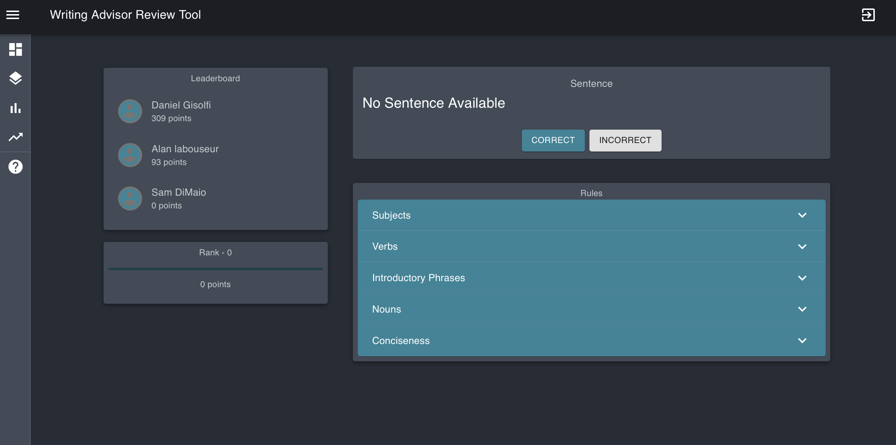 

This screenshot shows the main view of the front landing page which includes the main components of the reviewing tool. This includes a side bar, a leaderboard, a rank system, the sentence reviewer, and a display of the rules. There is also a log out button on the top right corner. The below screenshots will include more detail on each of these components.  

**Sidebar**

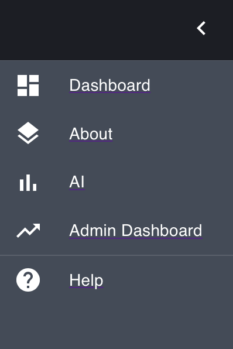

On the left hand side of the application there is a side bar which consists of tabs. The **Dashboard** tab is the main landing page. The **About** tab page will include information about the application as well as information about the creators of the application. The **AI** tab will tables and a graphical display that act as a placeholder for future training model data that will be collected from the application involving the accuracy of reviewing. The **Admin** tab will be used to look at site statistics involving total users on the application, latest activity on the system, and what operating system users are using. The **Help** tab is for FAQs the reviewer may come across when using the tool. 

**Sentence Review** 

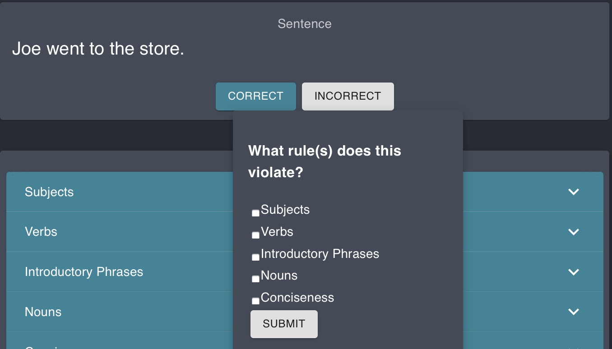

The Sentence Reviewer component is the center of the front landing page. It will display sentences that have been tagged for review. The reviewer can select correct if they believe the sentence is correct. If they believe the sentence contains an error, the user can select incorrect and check off the rule(s) they believe the sentence violates. Another sentences will keep appearing once marked.  

**Display of Rules** 

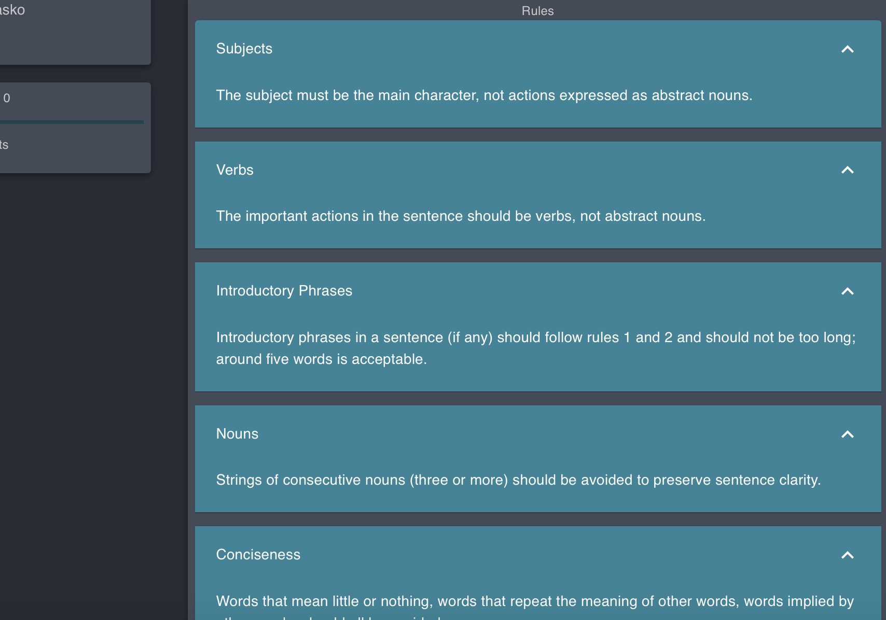

Below the sentence review section there is a display of the rules. It shows each rule with a drop down explaining the rule and what a violation of that rule entails. This will help the reviewer understand more clearly if they are unsure whether or not a rule pertains to a tagged sentence. 

**Leaderboard and Ranking System**

**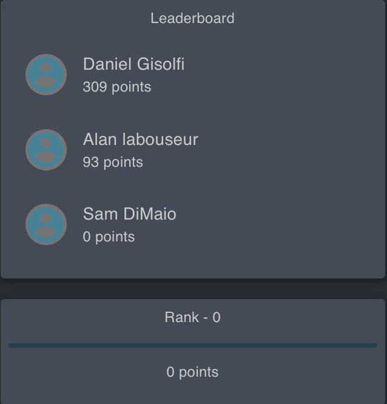**

On the left side of the front landing page there is a leaderboard and a rank component underneath. The leaderboard corresponds to the reputation system of the application. Reputation is earned through correctly reviewing a sentence (as correct or incorrect in accordance to agreement with majority of rewiewer's votes for a specific rule). If a submitted review meets this criteria, the reviewer gains 10 points. If the review does not meet this criteria, the reviewer loses 10 points. The Reviewer themself and the other Top 2 Reviewer's, based on the highest reputation, will be displayed on the leaderboard along with their current scores. The ranking will show what the user’s current score is. This allows the user's to see where they stand alongside the top Reviewer's in the system. 

##### About US

The About US page consists of information related to the purpose of the Writing Advisor Review tool and the creators of it. 

#####Artifical Intelligence 

1. Current Threads

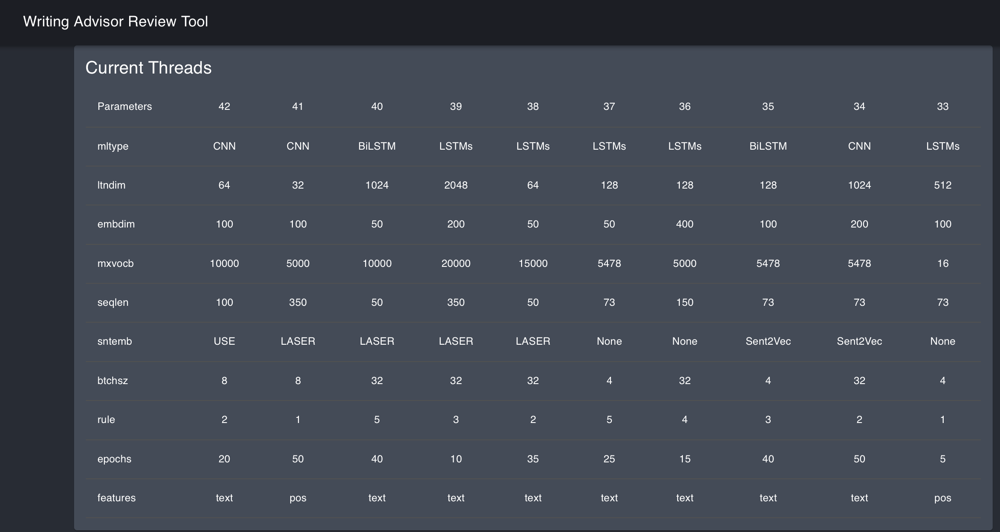

This table is used to display current models along with parameters regarding the model. A parameter is a variable that is internal to the model and can be estimated from data. They are required by the model when making predictions. 

1. Thread Status

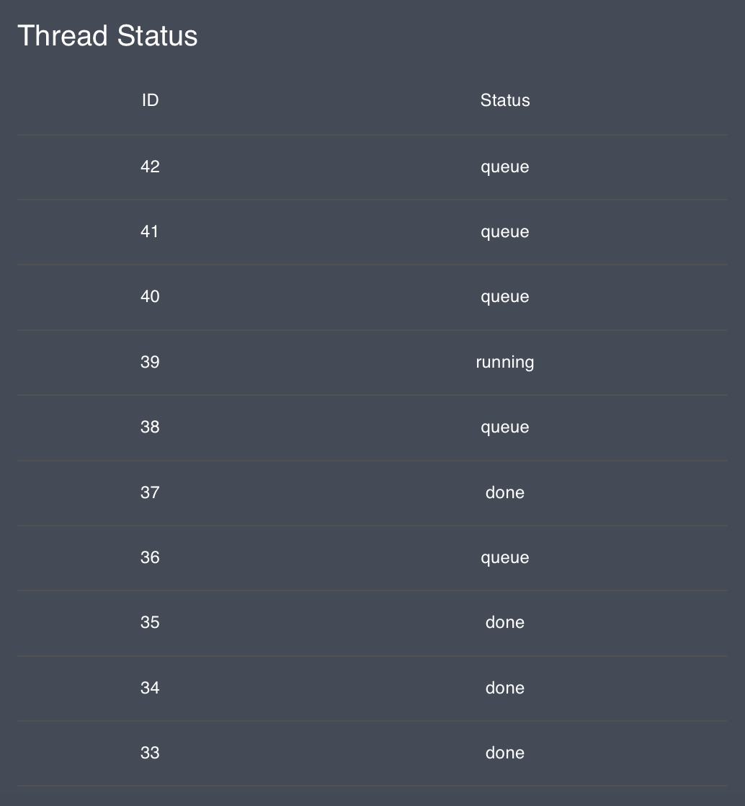

This table displays the ID of the model alongside it's current status. 

1. Hyper-Parameter Search Space 

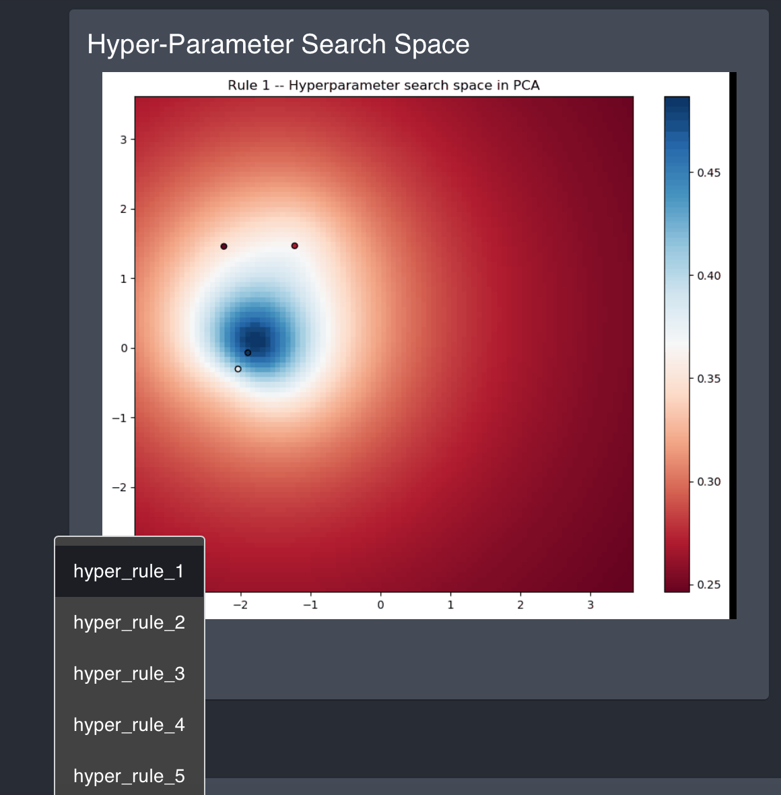

This section will be used to diplay images generated based on the model training data. 

#####Admin

1.   Full View

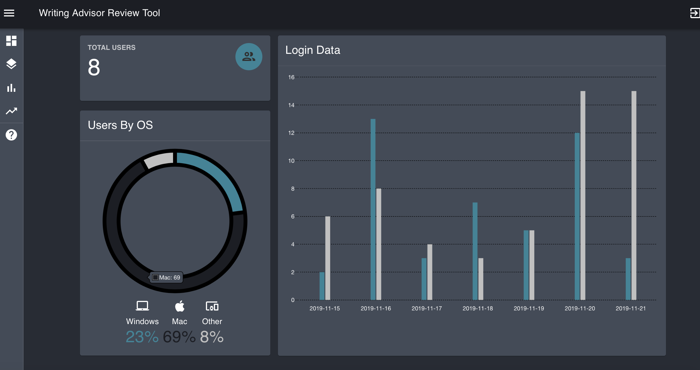

Here is the full frontal view of the Admin Page, which can be accessed through the left hand tab. 

2. Total Users

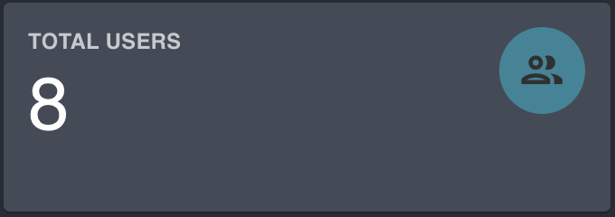

This section displays the total number of users currently in the system. 

3. Login Data

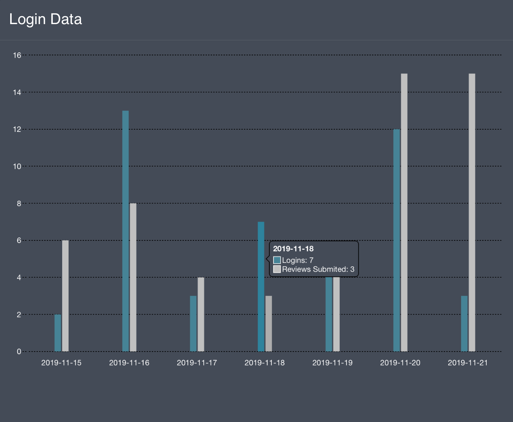

This section displays a graphical chart of login data by date. When hovering over the bar graphs, the number of logins appears along with the number of reviews submitted for that day. As the dates progress, this chart will update accordingly. 

4. Users by Operating System

   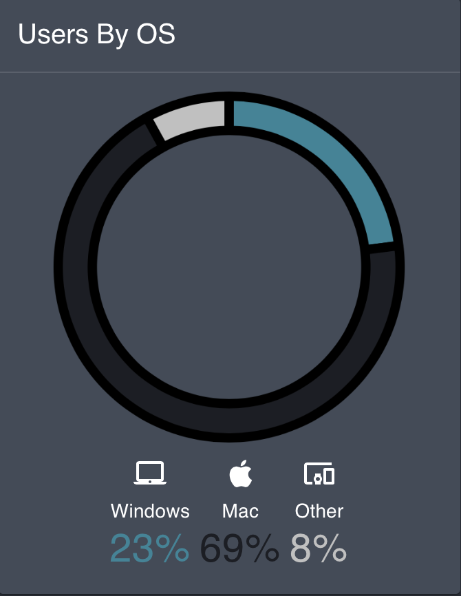

This section displays a chart that shows what operating system users are using. It is cateogorized into Windows, Mac, and Other with the percentage of users below. 

#####FAQ

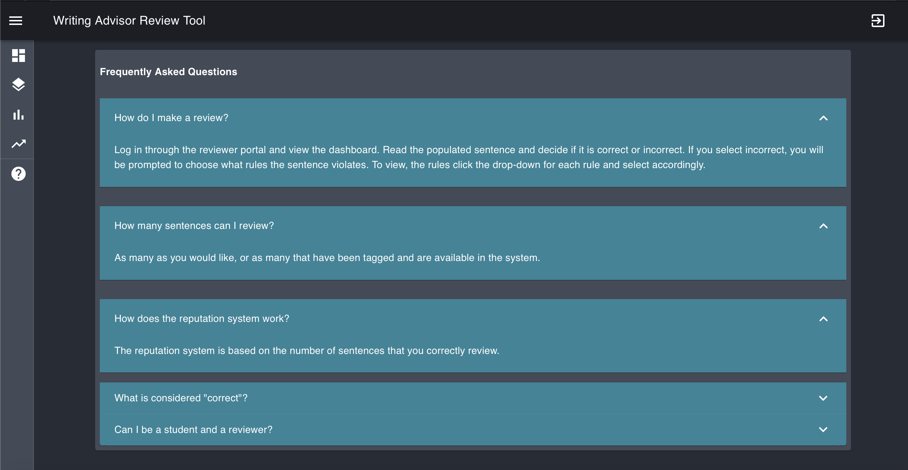

This page is used for FAQ's the user might have when using our system. They can access this page by choosing the tab with question mark labeled "Help" on the left hand side. If they see a question they would like to know the answer to, they can click on the drop down arrow on the right hand side to retrieve the answer. 

#### Theme

As per the clients request, the theme for the Writing Advisor Review tool is simple, functional, and user-friendly. Simple design has many advantages over complicated designs. They are easier for the user to navigate as well as easier for the developer to make fixes. We wanted to ensure the reviewer will not be overwhelmed when using our system as they need to focus to make proper judgements. We designed the system in darkmode for two main reasons. The first reason is that darkmode is very simple and astetically pleasing. Users want to use an application that they find appealing. The second reason takes into account the specific users of the system. Research has proven darkmode to be extremely beneficial in helping reduce headaches, dry eyes, headaches, and eyestrain. We want to promote minimal heath risk to the users on our system, as we recongnize this is their job and they could potentially spend hours using our system. Darkmode will prove extremely beneficial to reviewers reading many sentences a day. 